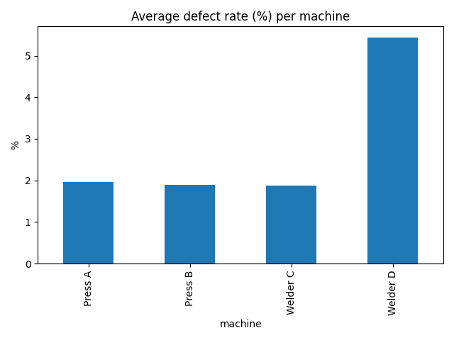
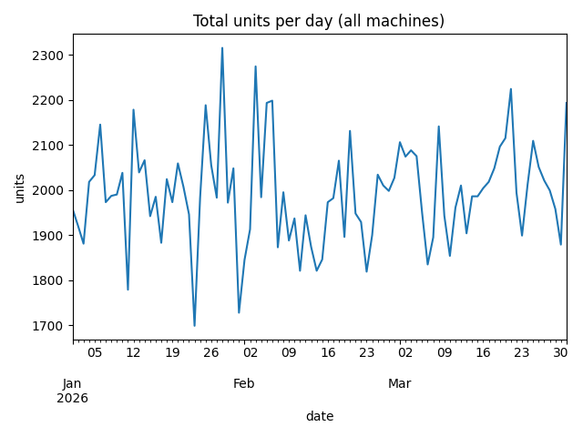

# Project 3, exploring operations data

Here I look at 90 days of production for 4 machines and 3 shifts before doing anything clever with it. The goal is to end with three findings a production manager could actually use.

I use describe(), groupby with named aggregations, a pivot table, a few matplotlib charts and a correlation.

## How to run it

```
python eda.py
```

It prints the tables and saves three charts, chart_defect_rate_by_machine.png, chart_units_over_time.png and chart_downtime_vs_defects.png.





## My three findings from the sample data

Welder D has the highest defect rate, around 5.4 percent, so it should be checked first.

The night shift defect rate is around 3.6 percent, compared to about 2.3 percent on the other shifts.

The correlation between downtime and defect rate is only about 0.07, which is weak, so downtime does not explain the defects here.

## Things I learned doing this

describe() is the fastest first look at any numeric data.

A pivot table with machines as rows and shifts as columns shows two things at once, that is where the night shift finding came from.

matplotlib.use("Agg") lets me save charts to files without a window popping up.

A finding is only useful if I can say it in one plain sentence.

