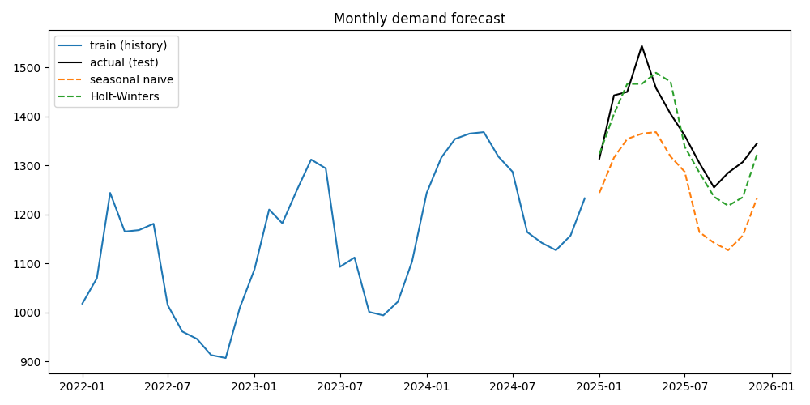

# Project 6, demand forecasting

This project forecasts monthly demand, but the important part is that I compare a proper model against simple baselines. A fancy model that cannot beat "same as last year" is useless.

I use a time series train and test split, naive and seasonal naive baselines, a moving average, Holt-Winters from statsmodels, and MAPE to score them.

## How to run it

```
pip install statsmodels
python forecast.py
```

It saves forecast_chart.png and forecast_results.csv.



## Results on the sample data, MAPE, lower is better

Holt-Winters, about 2.8 percent.

Seasonal naive, about 8.5 percent.

Naive, about 9.9 percent.

Moving average of 3 months, about 14.3 percent.

Holt-Winters wins because the data has both a trend and a yearly season, and that model handles both.

## Things I learned doing this

Never shuffle time series data. The past predicts the future, so I hold out the last 12 months as the test set.

Always start with a baseline. If my model does not beat seasonal naive, I do not trust it.

MAPE is easy to explain to a manager, "on average we are off by about 3 percent".

